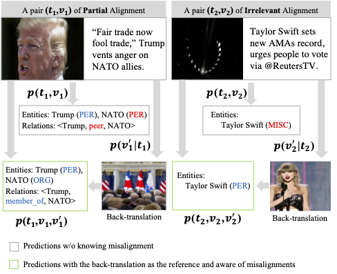
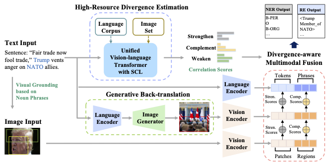
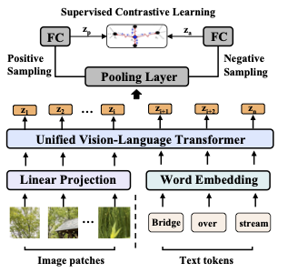
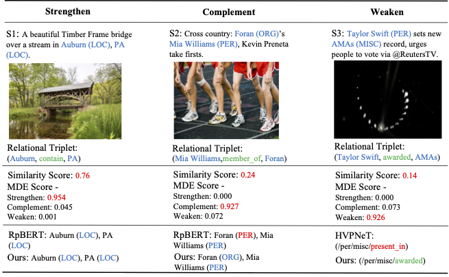
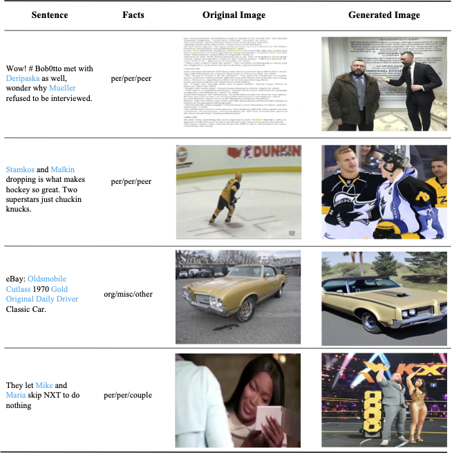

# Source Code of TMR for Multimodal Entity and Relation Extraction
Official Implementation of our Paper "Rethinking Multimodal Entity and Relation Extraction from A Translation Point of View" in ACL 2023.

## Motivation


We borrow the idea of “back-translation” for this purpose. The text description is first "translated" to an image reference using diffusion models. The reference is “back-translated” to text words/phrases. The alignment/misalignment can then be evaluated and used to help the extraction.

## Model Architecture
 

The framework of the proposed Translation motivated Multimodal Representation learning (TMR), which generates divergence-aware cross-modal representations by introducing two additional streams of Generative Back-translation and High-Resource Divergence Estimation.

## Required Environment
To run the codes, you need to install the requirements for [NER](TMR-NER/) or [RE](TMR-RE)
```
pip install -r requirements.txt
```

## Data Preparation
+ Twitter2015 & Twitter2017

You need to download three kinds of data to run the code.

1. The raw images of Twitter2015 and Twitter2017. 
2. The visual objects from the raw images.
3. Our generated images of Titter2015 and Twitter2017.

Then you should put folders `twitter2015_images`, `twitter2017_images`, `ner15_diffusion_pic`, `ner17_diffusion_pic`, `twitter2015_aux_images`, and `twitter2017_aux_images` under the "./data" directory.

+ MNRE

You need to download three kinds of data to run the code.

1. The raw images of MNRE.
2. The visual objects from the raw images.
3. Our generated images of MNRE.

Then you should put folders `img_org`, `img_vg`, `diffusion_pic` under the "./data" path.

## Data Preprocessing
To extract visual objects, we first use the NLTK parser to extract noun phrases from the text and apply the [visual grouding toolkit](https://github.com/zyang-ur/onestage_grounding) to detect objects. Detailed steps are as follows:

1. Using the NLTK parser (or Spacy, textblob) to extract noun phrases from the text.
2. Applying the [visual grouding toolkit](https://github.com/zyang-ur/onestage_grounding) to detect objects. For the original images, the extracted objects are stored in `img_vg`. The images of the object obey the following naming format: `imgname_pred_yolo_crop_num.png`, where `imgname` is the name of the raw image corresponding to the object, `num` is the number of the object predicted by the toolkit. For the generated images, the extracted objects are stored in the form of coordinates in file `./data/txt/mre_dif_train_dif.pth`.
3. For the orginal images, we construct a dictionary to record the correspondence between the raw images and the objects. Taking `mre_train_dif.pth` as an example, the format of the dictionary can be seen as follows: `{imgname:['imgname_pred_yolo_crop_num0.png', 'imgname_pred_yolo_crop_num1.png', ...] }`, where key is the name of raw images, value is a List of the objects.
4. For the generated images, when processing images, we crop them using the coordinates in the file to obtain visual objects.
5. For the original images, we suggest that you can use our visual objects. As for the generated images, if you want to use your own images instead of ours, we suggest that you can put your images in the path `./data/diffusion_pic` and detect visual objects through [visual grouding toolkit](https://github.com/zyang-ur/onestage_grounding) based on the giving phrases from `./data/txt/phrase_text_train.josn`.

## Path Structure
The expected structures of Paths are:

### Multimodal Named Entity Recognition
```
TMR-NER
 |-- ckpt # save the check point
 |-- data
 |    |-- twitter2015  # text data
 |    |    |-- train.txt
 |    |    |-- valid.txt
 |    |    |-- test.txt
 |    |    |-- twitter2015_train_dict.pth  # {imgname: [object-image]}
 |    |    |-- ...
 |    |    |-- ner_diff_train_weight_strong.txt  # strong correlation score for generated images
 |    |    |-- ner_train_weight_strong.txt  # strong correlation score for original images
 |    |    |-- ner_diff_train_weight_weak.txt  # weak correlation score for generated images
 |    |    |-- ner_train_weight_weak.txt  # weak correlation score for original images
 |    |    |-- ...
 |    |    |-- ner15_grounding_text_train.json # {imgname: phrase for object detection}
 |    |    |-- ...
 |    |    |-- train_grounding_cut_dif.pth # {imgname: [coordinates]}
 |    |    |-- ...
 |    |-- twitter2015_images       # original image data
 |    |-- twitter2015_aux_images   # visual object image data for original image
 |    |-- ner15_diffusion_pic   # generated image data
 |    |-- twitter2017
 |    |-- twitter2017_images
 |    |-- twitter2017_aux_images
 |    |-- ner17_diffusion_pic
 |-- models	# models
 |    |-- bert_model.py # our model
 |    |-- modeling_bert.py
 |-- modules
 |    |-- metrics.py    # metric
 |    |-- train.py  # trainer
 |-- processor
 |    |-- dataset.py    # processor, dataset
 |-- logs     # code logs
 |-- run.py   # main 
```

`bert_model.py` is the file for our TMR-NER model.

`metrics.py` is the file that sets evaluation indicators such as F1 score.

`dataset.py` is the file for processing raw data.

`train.py` is the file that sets up training, testing, and other processes.

`run.py` is used for running the whole program.


### Multimodal Relation Extraction

```
TMR-RE
 |-- ckpt # save the check point
 |-- data
 |    |-- txt  # text data
 |    |    |-- ours_train.txt # input data
 |    |    |-- ours_val.txt
 |    |    |-- ours_test.txt
 |    |    |-- mre_train_dict.pth  # {imgname: [object-image]}
 |    |    |-- ...
 |    |    |-- dif_train_weight_strong.txt  # strong correlation score for generated image
 |    |    |-- train_weight_strong.txt  # strong correlation score for original image
 |    |    |-- dif_train_weight_weak.txt  # weak correlation score for generated image
 |    |    |-- train_weight_weak.txt  # weak correlation score for original image
 |    |    |-- ...
 |    |    |-- phrase_text_train.json # {imgname: phrase for object detection}
 |    |    |-- ...
 |    |    |-- mre_dif_train_dif.pth # {imgname: [coordinates]}
 |    |    |-- ...
 |    |-- img_org       # original image data
 |    |-- img_vg   # visual object image data for original image
 |    |-- diffusion_pic   # our generated image data
 |    |-- ours_rel2id.json # target relations
 |-- opennre	# main framework 
 |    |-- encoder # main model
 |    |    |-- bert_encoder.py # TMR-RE
 |    |    |-- modeling_bert.py
 |    |-- framework # processing files
 |    |    |-- data_loader.py # data processor
 |    |    |-- sentence_re.py # trainer
 |    |    |-- utils.py
 |    |-- model # classifier
 |    |    |-- softmax_nn.py # main classifier
 |    |    |-- modeling_bert.py 
 |    |    |-- base_model.py # supporting the classifier, no modification required
 |    |-- tokenization # tokenizers, no modification required
 |    |-- pretrain.py # basic file
 |    |-- utils.py # basic file
 |-- opennre.egg-info
 |-- results # saving the results
 |    |-- test # results for test set
 |    |-- val # results for validation set
 |-- run.py   # main 
```

A combination of `bert_encoder.py` and `softmax_nn.py` becomes our TMR-NER model.

`data_loader.py` is the file for processing raw data.

`sentence_re.py` is the file that sets up training, testing, and other processes.

`run.py` is used for running the whole program.

## Model Training
The data path and GPU-related configuration are in the `run.py`. To train the NER model, run this script:

```shell
python -u run.py \
	--dataset_name='twitter15/17'\
	--bert_name="bert-large-uncased"\
	--num_epochs=30\
	--eval_begin_epoch=12\
	--batch_size=12\
	--lr=3e-5\
	--warmup_ratio=0.01\
	--seed = 1234\
	--do_train\
	--ignore_idx=0\
	--max_seq=70\
	--sample_ratio=1.0\
	--save_path="your_ner_ckpt_path"
```

To train the RE model, run this script:

```shell
python run.py \
      --ckpt='your_re_ckpt_path' \
      --max_epoch=20 \
      --batch_size=16 \
      --lr=1e-5 \
      --sample_ratio=1.0
```

## Model Testing
To test the NER model, you can set `load_path` to the trained model path, then run the following script:

```shell
python -u run.py \
      --dataset_name="twitter15/twitter17" \
      --bert_name="bert-large-uncased" \
      --only_test \
      --max_seq=70 \
      --sample_ratio=1.0 \
      --load_path='your_ner_ckpt_path'
```

The settings are similar for RE testing:


```shell
python run.py \
      --ckpt='your_re_ckpt_path' \
      --max_epoch=20 \
      --batch_size=16 \
      --lr=1e-5 \
	  --test_only \
      --sample_ratio=1.0 \
```

## Divergence Estimation

Below is the Architecture of our Multimodal Divergence Estimator (MDE), which is trained on high-resource vision-language datasets, and Supervised Contrastive Learning (SCL) is applied to enhance the generalization.

   

You can find the codes and pre-trained weights in [Divergence Estimator](Divergence Estimator/).

## Back Translation

We generate the back-translated images from the text prompt with the [stable-diffusion model](https://github.com/CompVis/stable-diffusion). Please follow their instructions to install the corresponding environment.

Also, we provide the scripts to extract and save the generated images in [Back Translation] (Back Translation/). Just modify the paths and run the scripts:
```
python diffusion.py
```

Some generated examples are shown as:




